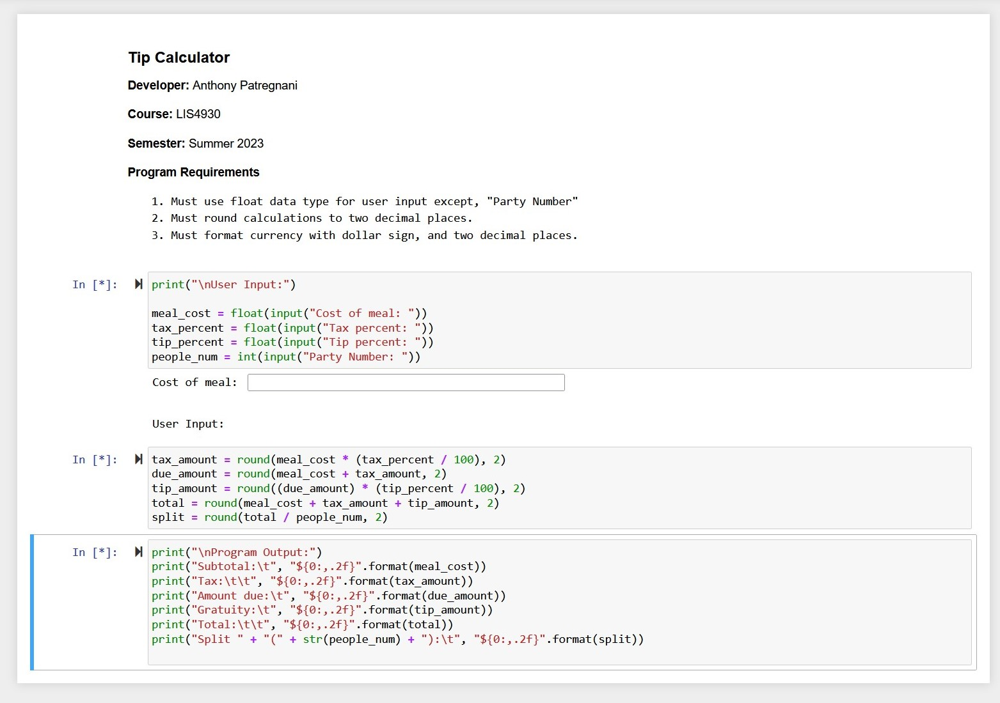
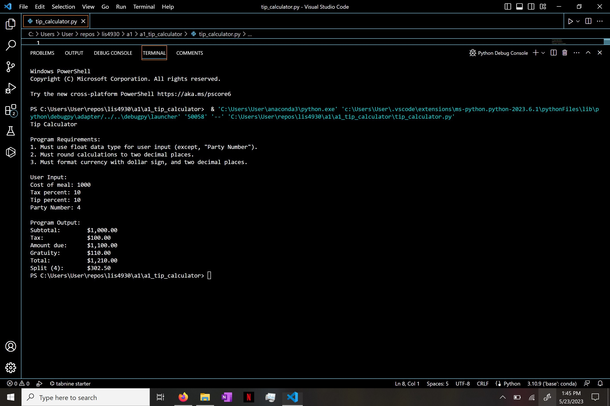
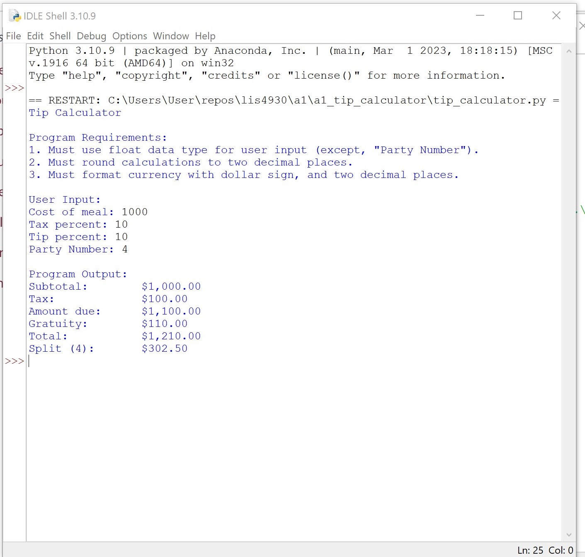

> **NOTE:** This README.md file should be placed at the **root of each of your repos directories.**
>
>Also, this file **must** use Markdown syntax, and provide project documentation as per below--otherwise, points **will** be deducted.
>

# LIS4930

## Anthony Patregnani

### Assignment 1 Requirements:

*Sub-Heading:*

1. Install Python
2. Create Bitbucket Repo
3. Provide Screenshots of installation

#### README.md file should include the following items:

* Screenshot of a1_tip_calculator application running
* Link to A1 .ipynb file: [tip_calculator.ipynb](a1_tip_calculator/tip_calculator.ipynb "A1 Jupyter Notebook") 
* git commands w/ short descriptions 

> This is a blockquote.
> 
> This is the second paragraph in the blockquote.
>
> #### Git commands w/short descriptions:

1. git init - creates a new Git repository
2. git status - displays the state of the working directory and the staging area
3. git add - adds a change in the working directory to the staging area
4. git commit - commit a snapshot of all changes in the working directory
5. git push - used to upload local repository content to a remote repository
6. git pull - used to fetch and download content from a remote repository and immediately update the local repo to match
7. git fetch - primary command used to download contents from a remote repository

#### Assignment Screenshots:

*Screenshot of Jupyter Notebook running http://localhost*:

*Screenshot of running Tip Calculator on VS Code*:

*Screenshot of running Tip Calculator on IDLE*:

#### Tutorial Links:

*Bitbucket Tutorial - Station Locations:*
[A1 Bitbucket Station Locations Tutorial Link](https://bitbucket.org/ap19t/bitbucketstationlocations/ "Bitbucket Station Locations")
