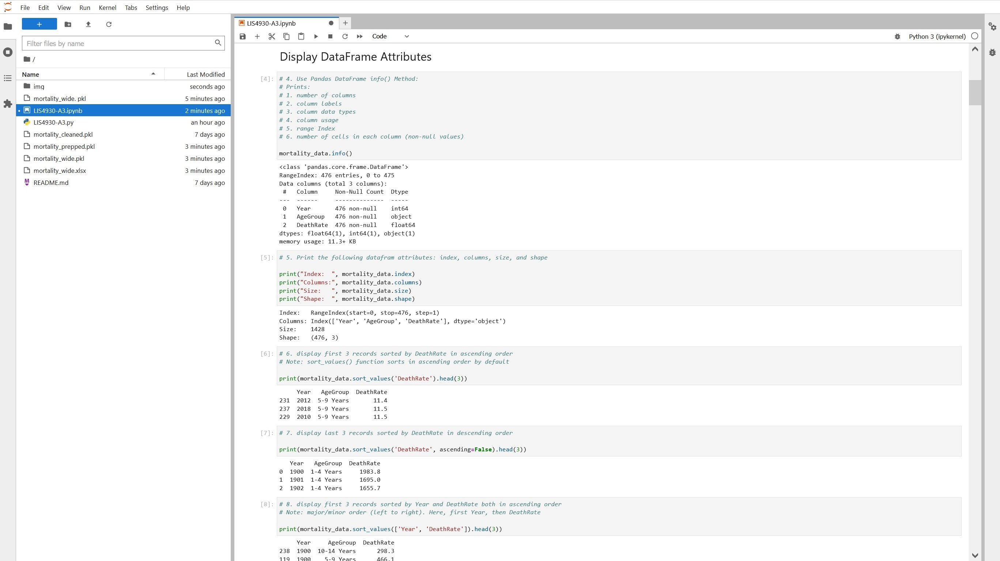
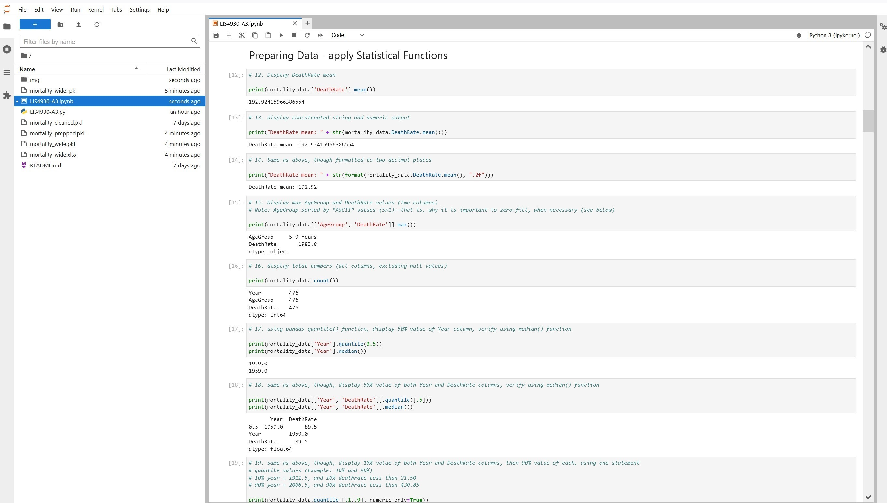

> **NOTE:** This README.md file should be placed at the **root of each of your repos directories.**
>
>Also, this file **must** use Markdown syntax, and provide project documentation as per below--otherwise, points **will** be deducted.
>

# LIS4930

## Anthony Patregnani

### Assignment 3 Requirements:

*Sub-Heading:*

1. Backwards Engineer Python Program
2. Use Jupyter Notebook/labs to display program
3. Provide Screenshots of installation

#### README.md file should include the following items:

* Screenshot of Assignment 3 application running
* Link to A3 .ipynb file: [LIS4930-A3.ipynb](LIS4930-A3.ipynb "A3 Jupyter Notebook") 

#### Assignment 3 Screenshots:

*Screenshot of Jupyter Notebook running http://localhost*:

*Screenshot of Jupyter Notebook running http://localhost*:

*Screenshot of Jupyter Notebook running http://localhost*:

*Screenshot of Jupyter Notebook running http://localhost*:

